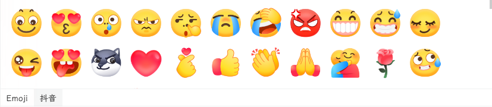
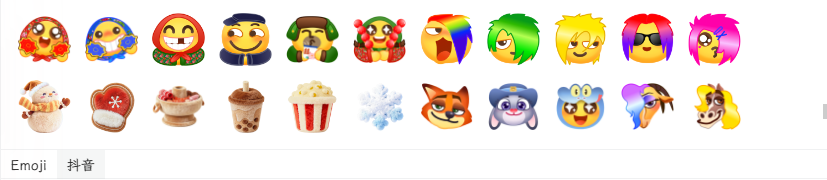
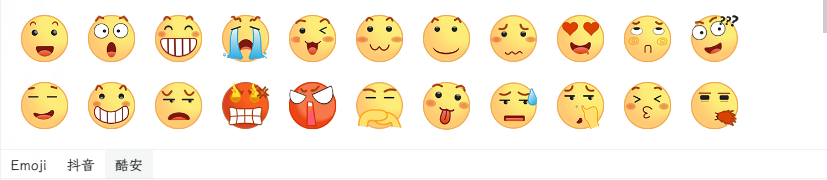
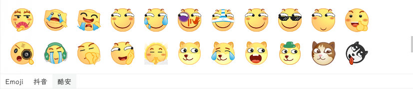
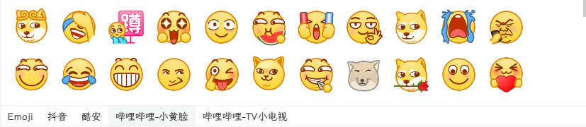
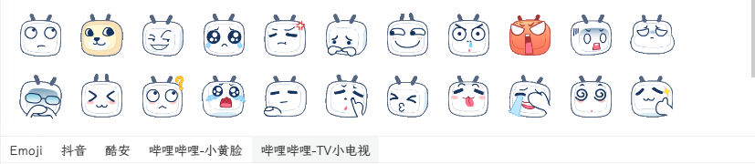
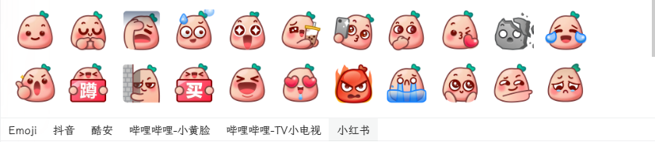
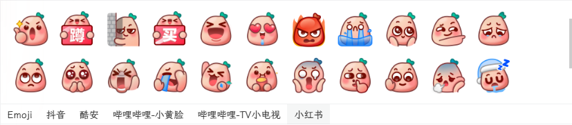

# Stickers - 社交平台表情包收集

精选收集各大社交平台的高质量表情包，适用于 Twikoo、Artalk 等评论系统。

## 快速使用

直接引用 CDN 链接：

```
https://cdn.jsdmirror.com/gh/Augenstern-O/Stickers/OwO.json
```

## 已收录平台

- **Emoji** - 笑脸与情感
- **抖音** - 含限时表情
  
  
- **酷安**
  
  
- **哔哩哔哩** - 包含小黄脸、TV小电视
  
  
- **小红书** - 动图
  
  

## 使用方法

### Twikoo 评论系统

在 Twikoo 配置中修改EMOTION_CDN为：

```
https://cdn.jsdmirror.com/gh/Augenstern-O/Stickers/
```

### Artalk 评论系统

在 Artalk 配置中添加：

```yaml
frontend:
  emoticons: https://cdn.jsdmirror.com/gh/Augenstern-O/Stickers/OwO.json
```

## 项目结构

```
Stickers/
├── OwO.json                 # 表情包OwO格式文件
└── Douyin/                  # 抖音表情包图片
    ├── weixiao.png
    └── ...
└── Coolapk/                 # 酷安表情包图片
    ├── hahaha.png
    └── ...
└── BiliBili/                # 哔哩哔哩表情包图片
    └── 小黄脸
        ├── doge_金箍.png
        └── ...
    └── TV小电视
        ├── tv_白眼.png
        └── ...
    └── ...
└── RedNote/                 # 小红书表情包图片
    └── 微笑.png
    └── ...
```

## 贡献

欢迎提交 PR 添加更多平台的表情包！

1. Fork 本仓库
2. 创建新的平台文件夹（如 `WeChat/`、`QQ/` 等）
3. 添加表情包图片
4. 更新 `OwO.json` 配置
5. 提交 Pull Request

## 开源协议

本项目采用 [CC BY 4.0](https://creativecommons.org/licenses/by/4.0/) 协议开源。

## Star History

如果这个项目对你有帮助，欢迎 Star 支持！
