# Stickers - 社交平台表情包收集

精选收集各大社交平台的高质量表情包，适用于 Twikoo、Artalk 等评论系统。

## 快速使用

直接引用 CDN 链接：

```
https://cdn.jsdmirror.com/gh/Augenstern-O/Stickers/OwO.json
```

## 已收录平台

- **Emoji** - 笑脸与情感
- **抖音** - 含限时表情
  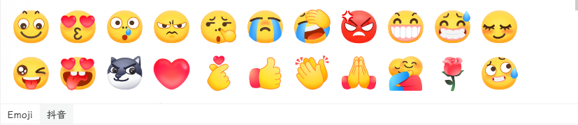
  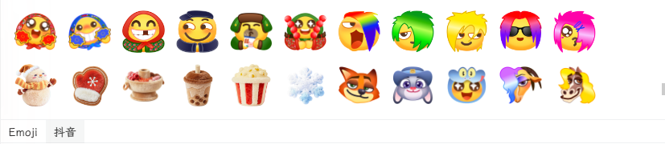
- **酷安** - 含酷小牛系列
  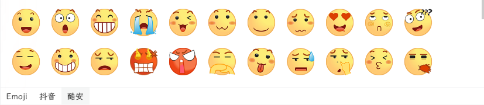
  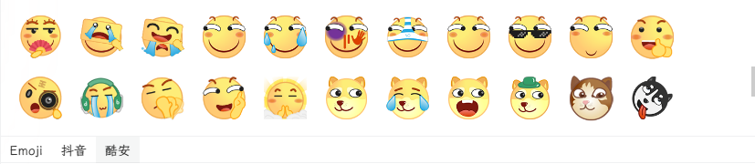
  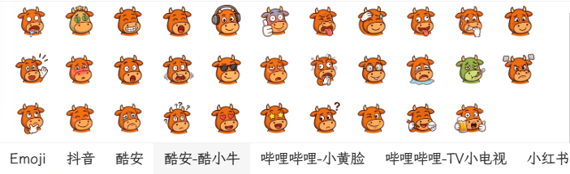
- **哔哩哔哩** - 包含小黄脸、TV小电视
  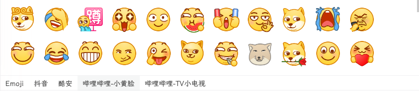
  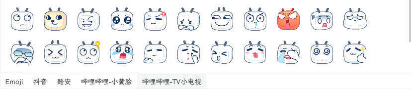
- **小红书** - 动图
  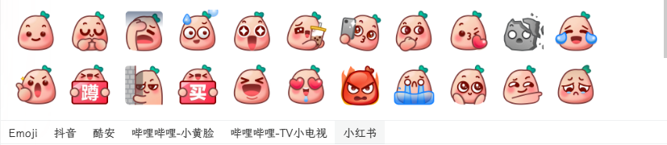
  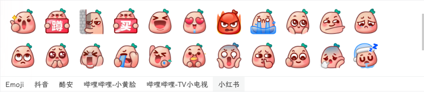
- **QQ** - 包含小黄脸表情、QQ黄脸、emoji表情、隐藏表情、互动表情、汪汪、喜花妮、企鹅、噗噗星人
  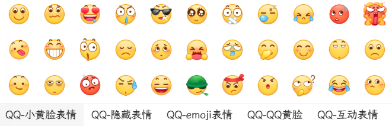
  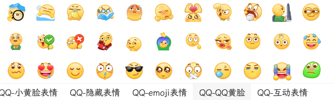
- **飞书** - 含深浅色变体
- **钉钉** - 含动图

## 使用方法

### Twikoo 评论系统

在 Twikoo 配置中修改EMOTION_CDN为：

```
https://cdn.jsdmirror.com/gh/Augenstern-O/Stickers/
```

### Artalk 评论系统

在 Artalk 配置中添加：

```yaml
frontend:
  emoticons: https://cdn.jsdmirror.com/gh/Augenstern-O/Stickers/OwO.json
```

## 项目结构

```
Stickers/
├── OwO.json                     # 表情包OwO格式文件
├── Images/Example/              # README 展示用截图
├── Douyin/                      # 抖音表情包图片
│   ├── weixiao.png
│   └── ...
├── Coolapk/                     # 酷安表情包图片
│   ├── hahaha.png
│   ├── 酷小牛/                  # 酷安-酷小牛系列
│   │   ├── 牛牛呲牙笑.png
│   │   └── ...
│   └── ...
├── BiliBili/                    # 哔哩哔哩表情包图片
│   ├── 小黄脸/
│   │   ├── doge_金箍.png
│   │   └── ...
│   └── TV小电视/
│       ├── tv_白眼.png
│       └── ...
├── RedNote/                     # 小红书表情包图片
│   ├── 微笑.png
│   └── ...
├── QQ/                          # QQ表情包图片
    ├── 小黄脸表情/
    ├── QQ黄脸/
    ├── emoji表情/
    ├── 隐藏表情/
    ├── 互动表情/
    ├── 汪汪/
    ├── 喜花妮/
    ├── 企鹅/
    └── 噗噗星人/
├── Feishu/                      # 飞书表情包图片
│   ├── 赞.png
│   └── ...
└── DingTalk/                    # 钉钉表情包图片
    ├── 666.png
    └── ...
```

## 贡献

欢迎提交 PR 添加更多平台的表情包！

1. Fork 本仓库
2. 创建新的平台文件夹（如 `WeChat/` 等）
3. 添加表情包图片
4. 更新 `OwO.json` 配置
5. 提交 Pull Request

## 开源协议

本项目采用 [CC BY 4.0](https://creativecommons.org/licenses/by/4.0/) 协议开源。

## Star History

如果这个项目对你有帮助，欢迎 Star 支持！
